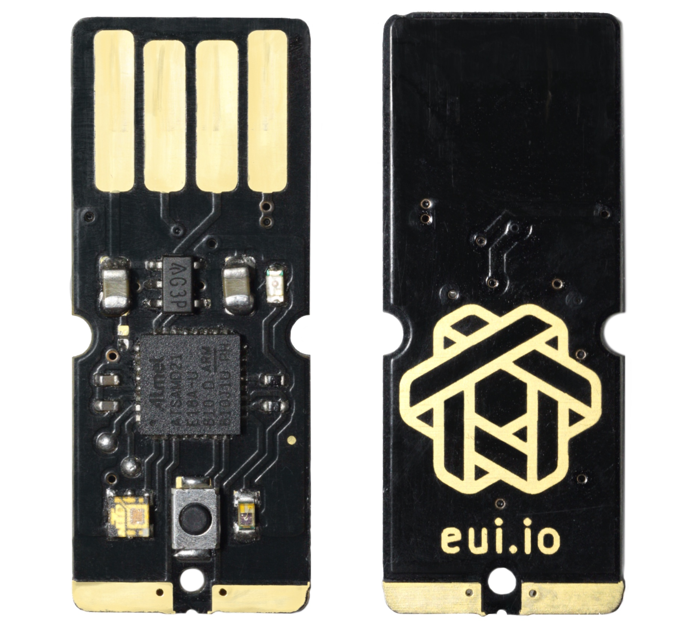

# Electric UI HelloBoard
This is a tiny USB based evaluation board which makes development against a common platform easier, and helps introduce new users to [Electric UI](https://electricui.com/) who may not have hardware on hand.

## Background

The board is based on the Atmel SAMD21E18 microcontroller, a neat little ARM Cortex M0 core in a compact 32 pin package.

The main goal of the board is to provide a quick and painless development experience to people who might not have played with embedded hardware before.

By including a few interactive components, and leveraging existing supported designs and software, the process should be as user-friendly as possible with no additional hardware/software modifications.

## Specifications

The board is *very* closely related to the [Adafruit Trinket M0](https://www.adafruit.com/product/3500) design, but uses an insertable male USB footprint rather than rely on a USB micro cable. The KiCAD design files, gerbers and PDF's are in `/hardware`.

It includes an ambient light sensor, click button, two capacitive touch pads, and a [APA102-2020 RGB LED](https://cpldcpu.wordpress.com/2014/08/27/apa102/) for the user to interact with, discarding the USB micro connector and some power supply related components on the Trinket.

The micro-controller is suitably capable for it's footprint:

- 256kB Flash memory (program storage)
- 32kB RAM
- 32-bit ARM M0 core running at 48MHz
- Native USB
- Supported by the Arduino IDE, or CircuitPython

The small 'thumb-drive' form factor is intended to make the sticks easy to carry and give away.

## Firmware Examples

The `/firmware` directory has a series of Arduino sketches which provide base examples for interacting with the hardware.

Most [basic and intermediate example sketches](https://github.com/electricui/electricui-embedded/tree/master/examples) in the [`electricui-embedded`](https://github.com/electricui/electricui-embedded) corpus should be directly compatible without modification.

## Flashing Firmware

The Adafruit M0 bootloader is used on this board, which supports the Arduino IDE through BOSSA, and will also enumerate as a USB mass storage device. [Simply dropping any compatible UF2 file](https://learn.adafruit.com/adafruit-feather-m0-express-designed-for-circuit-python-circuitpython/uf2-bootloader-details) on the 'drive' will update the firmware.

### Arduino IDE

The bootloader supports Arduino IDE flashing out of the box.

Install the SAMD and Adafruit SAMD hardware definitions from the *Boards Manager*, as [described in this Adafruit guide](https://learn.adafruit.com/adafruit-trinket-m0-circuitpython-arduino/using-with-arduino-ide).

Select Trinket M0 and the USB device in the Tools dropdown, then just flash the board as normal.

> **Note about Serial.print()**
>
> The Adafruit documentation is incorrect regarding usage of `Serial` vs `SerialUSB`. This hardware does not require `SerialUSB` to be used in sketches, as indicated in the [Adapting Sketches to M0](https://learn.adafruit.com/adafruit-trinket-m0-circuitpython-arduino/adapting-sketches-to-m0). That guide is relevant to other Atmel SAMD boards, but the Trinket just uses `Serial` by default.

### UF2

Plug the USB stick into a compatible computer (Windows, macOS, Linux are all fine), and drop a UF2 file into the root of the `TRINKETBOOT` disk.

### SWD Probe

A SWD programmer is required to burn the boot-loader on new hardware for the first time, but can also be used to burn firmware as part of normal development. Doing this will save some memory normally used by the boot-loader.

While any other Atmel compatible SWD programmer (OpenOCD compatible, Atmel branded, or otherwise) can be used, I used a J-Link on Linux (Solus) to flash the boards for the first time. Programming wires are either soldered on or held in place (the two exposed round pads just above the RGB led), and the JLinkExe tool is used to burn the boot-loader binary as described [in this thread](https://forums.adafruit.com/viewtopic.php?f=57&t=142170) (and below):

1. Build the bootloader by cloning the [adafruit uf2-samdx1 repo](https://github.com/adafruit/uf2-samdx1), then running `make BOARD=trinket_m0` on a *nix system.
2. Connect a compatible JLink programmer.
3. From the `/build/trinket_m0` folder, execute `JLinkExe` which I had installed in `/opt/segger/jlink`.
4. `si 1` to set the programming mode to SWD,
5. `speed 4000` to set programming speed to *4kHz*,
6. `device ATSAMD21E18` for this target,
7. `loadbin bootloader-trinket_m0-v2.0.0-adafruit.9-2-g1e0d553.bin, 0x00000000` to burn the freshly built Trinket M0 bootloader to the base address `0x00000000`.
8. `r` to reset the device,
9. `g` to run the program (though I'd advise just power cycling the target at this point),

## Manufacture & Assembly

[Makerfabs](https://www.makerfabs.com/) produced the boards, but any basic tier fab should work fine. 2.0mm thick FR4 is required to fit in normal sockets, and I'd recommend an ENIG finish as it looks a lot nicer.

The rest of the parts can be ordered from DigiKey or Adafruit (if you pull parts off existing Trinket M0 boards).

Assembly should be done with paste and hot air, or a reflow oven if possible. As this board has some fine pitch parts and 0402 components, its not the easiest board for a beginner to assemble. 

I was able to assemble boards by hand without magnification, so people familiar with 0402 and 0.5mm pitch QFN parts shouldn't have too many issues.